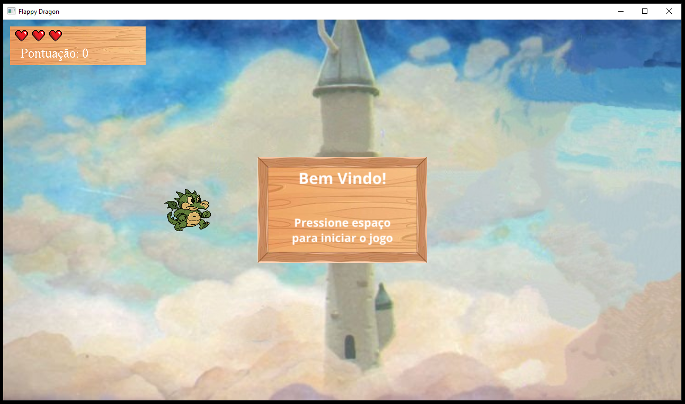
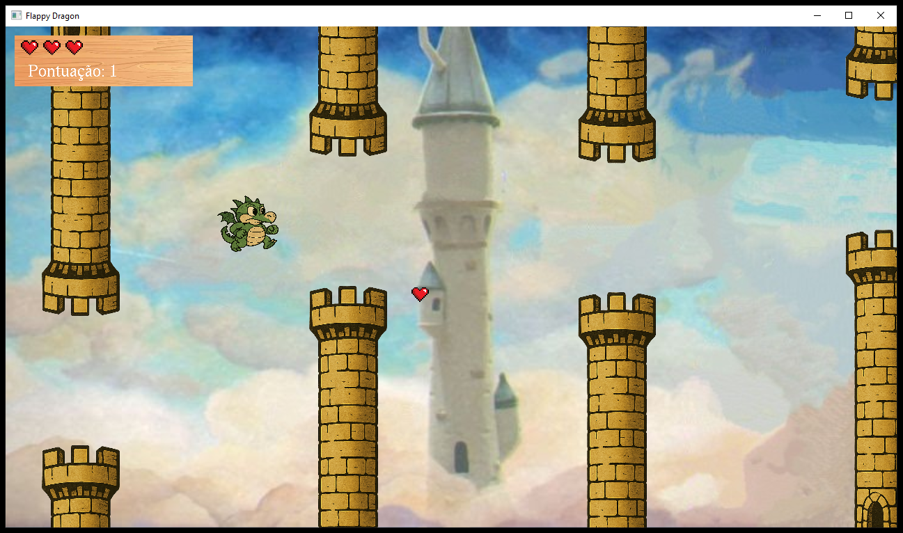
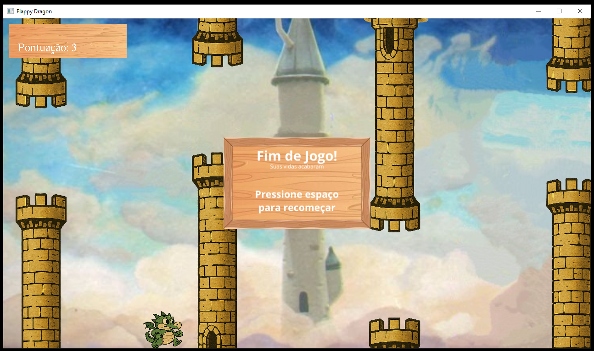

## Descrição
Programa no formato do jogo Flappy Bird utilizando a API do OpenGL para Python para implementar.

## Lista de Tarefas
|   |    Descrição                                                                         |
|---|--------------------------------------------------------------------------------------|
| ✅ | Inicializar Janela com Plano de Fundo                                               |
| ✅ | Carregar o Personagem com Físicas e Vôo                                             |
| ✅ | Criar Motor de Geração, Movimento e Colisão de Obstáculos                           |
| ✅ | Criar Mecânica de Múltiplas Vidas                                                   |
| ✅ | Criar Scoreboard de Pontos e Vidas e Mostrar em Tela                                |
| ✅ | Ao acabar as vidas, mostrar scoreboard e botão de reiniciar ou sair                 |
| ✅ | Criar Powerup aleatório de ganhar vida                                              |
| ✅ | Antes de começar o jogo, mostrar popup instruindo a apertar espaço para iniciar     |
| ✅ | Revisar Código e Documentação e adicionar prints do programa em execução no Git     |
| ❌ | Adicionar Música de Plano de Fundo?                                                 |
| ❌ | Evoluir Detecção de Colisão, e física de pulo e queda                               |

## Requerimentos para Execução
- Python 3.10;
- Instação das seguintes bibliotecas: `pip install numpy glfw Pillow PyOpenGL PyOpenGL_accelerate`.

## Screenshots do Jogo em Execução

### 1. Tela Inicial

### 2. Jogo em Andamento

### 3. Fim de Jogo
